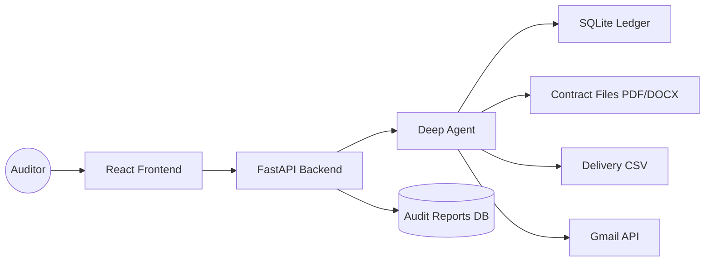

# AI Financial Auditor 📈

An end-to-end automated auditing system that identifies delivery discrepancies and calculates contractual penalties using Large Language Model (LLM) agents.

## 🎯 The Problem
Financial auditors at manufacturing firms spend countless hours manually cross-referencing **vendor contracts** (PDFs/DOCX) against **warehouse delivery logs** (CSV/DB) to identify late deliveries and calculate penalties. This process is tedious, error-prone, and scales poorly.

## 🚀 The Solution
The **AI Financial Auditor** replaces this manual effort with a reasoning agent. The system automatically:
1.  **Retrieves** account data from a SQL ledger.
2.  **Parses** unstructured legal contracts to find specific penalty clauses.
3.  **Analyzes** delivery logs to determine the exact number of days a shipment was late.
4.  **Calculates** the financial penalty based on the contract rules.
5.  **Notifies** the vendor via Gmail to initiate the recovery process.
6.  **Presents** the findings to a human auditor for final approval.

## 🏗️ Architecture



### Core Components:
- **Deep Agent Engine:** A tool-augmented agent capable of multi-step reasoning.
- **Pydantic Structured Output:** Ensures the agent always returns a strict `DiscrepancyReport` schema, enabling seamless integration with the database and frontend.
- **Human-in-the-Loop (HITL):** A review workflow where agents propose penalties and humans approve/reject them before they are exported to a settlement sheet.
- **Telemetry System:** Captures the agent's internal "Chain of Thought" for full auditability.

## 🛠️ Technical Highlights
- **Tool Orchestration:** Implemented specialized tools for SQL execution, document parsing, and external notifications.
- **Schema Enforcement:** Used Pydantic for guaranteed structured output, eliminating "hallucinations" in financial reporting.
- **Automated Validation:** Includes a gold-standard evaluation dataset to measure agent accuracy against known-good audit results.
- **Full-Stack Integration:** A complete pipeline from raw unstructured data to a managed UI and final Excel export.

## 🚦 Getting Started

### Setup
```bash
uv sync
cp .env.example .env
```
Set `OPENROUTER_API_KEY` and `OPENROUTER_MODEL` in `.env`.

### Run
**Self-Check (CLI):**
```bash
uv run python main.py --self-check
```

**Backend API:**
```bash
uv run python app/backend/main.py
```

**Tests:**
```bash
uv run pytest
```
